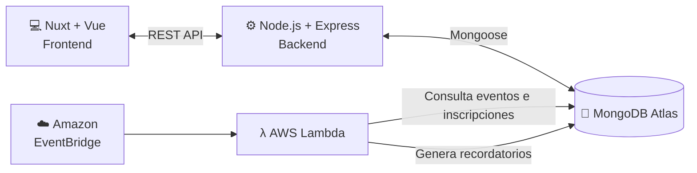

<div align="center">


<a href="https://www.linkedin.com/in/johnaraya/">
  
</a>
<a href="mailto:johnae1205@gmail.com">
  
</a>
<a href="https://github.com/JohnArayaE">
  
</a>

<br/><br/>


</div>

---

## 👨‍💻 Sobre mí

Soy **Full Stack Developer** con interés en el desarrollo de aplicaciones web, APIs, bases de datos, arquitectura de software y tecnologías **Cloud**.

Me gusta trabajar en proyectos completos, conectando diferentes capas de una aplicación: desde la interfaz y la experiencia del usuario hasta el backend, la persistencia de datos y la automatización mediante servicios en la nube.

```javascript
const john = {
  role: "Full Stack Developer",
  interests: ["Backend", "Frontend", "Databases", "Cloud"],
  currentlyWorkingWith: [
    "Vue.js",
    "Nuxt",
    "Node.js",
    "Express",
    "MongoDB",
    "AWS"
  ],
  goal: "Build useful, scalable and well-structured software"
};
```

---

# 🚀 Proyecto destacado

<div align="center">

## CommunityHub

### Plataforma Full Stack para gestión y participación en actividades y eventos

</div>

**CommunityHub** es una aplicación web completa que integra frontend, API REST, base de datos y servicios cloud.

El sistema permite administrar usuarios y actividades, manejar diferentes roles, realizar inscripciones, guardar favoritos y generar notificaciones automáticas para eventos próximos.

### ⚡ Arquitectura del sistema



### 🧩 Componentes

|    | Componente           | Tecnologías                                     | Repositorio                                                        |
| -- | -------------------- | ----------------------------------------------- | ------------------------------------------------------------------ |
| 💻 | **Frontend**         | Nuxt 4 · Vue 3 · TypeScript · Pinia · PWA       | [Ver Frontend](https://github.com/JohnArayaE/ProyectoWeb2_Fronted) |
| ⚙️ | **Backend API**      | Node.js · Express 5 · MongoDB · Mongoose · JWT  | [Ver Backend](https://github.com/RNVG/ProyectoWeb2_Back)           |
| ☁️ | **Cloud Automation** | AWS Lambda · Amazon EventBridge · MongoDB Atlas | [Ver Lambda](https://github.com/JohnArayaE/ProyectoWeb2_Lambda)    |

### ✨ Funcionalidades principales

* 🔐 Autenticación mediante **JSON Web Tokens**
* 👥 Roles de **usuario, organizador y administrador**
* 📅 Creación y administración de actividades
* 🎟️ Inscripción de usuarios en eventos
* ❤️ Sistema de favoritos
* 🔎 Búsqueda y filtrado de actividades
* 📊 Dashboards adaptados según el rol
* 🗃️ Persistencia mediante **MongoDB Atlas**
* 🔌 Comunicación Frontend–Backend mediante **REST API**
* 📱 Soporte **Progressive Web App**
* ☁️ Integración con **AWS**
* ⚡ Procesamiento serverless mediante **AWS Lambda**
* ⏰ Ejecuciones programadas con **Amazon EventBridge**
* 🔔 Generación automática de recordatorios para actividades próximas

---

# 🛠️ Tech Stack

<div align="center">

### Frontend


### Backend & Databases


### Cloud & Tools


<br/>


</div>

---

# ☁️ Cloud & Backend

Una de las áreas que más me interesa es la integración entre aplicaciones tradicionales y servicios cloud.

En **CommunityHub**, Amazon EventBridge ejecuta periódicamente una función AWS Lambda que consulta MongoDB Atlas, identifica actividades que comienzan dentro de las próximas 24 horas, encuentra los usuarios inscritos y genera sus notificaciones automáticamente.

Esto permite ejecutar procesos independientemente del frontend y del backend principal.

```text
Amazon EventBridge
        │
        ▼
    AWS Lambda
        │
        ▼
  MongoDB Atlas
        │
        ├── Busca actividades próximas
        ├── Consulta usuarios inscritos
        └── Genera recordatorios
```

---

# 📊 GitHub

<div align="center">


<br/>


</div>

---

# 🌱 Actualmente

Estoy fortaleciendo mis conocimientos en:

`Full Stack Development` · `Backend Development` · `REST APIs` · `Databases` · `Cloud Computing` · `AWS` · `Software Architecture`

---

# 📫 Contacto

<div align="center">

### ¿Quieres contactarme?

📧 **[johnae1205@gmail.com](mailto:johnae1205@gmail.com)**

<br/>

<a href="mailto:johnae1205@gmail.com">
  
</a>

<a href="https://www.linkedin.com/in/johnaraya/">
  
</a>

<a href="https://github.com/JohnArayaE">
  
</a>

</div>

<br/>

<div align="center">

### 💻 Building • Learning • Improving

<i>Transformando ideas en aplicaciones, una línea de código a la vez.</i>

</div>


